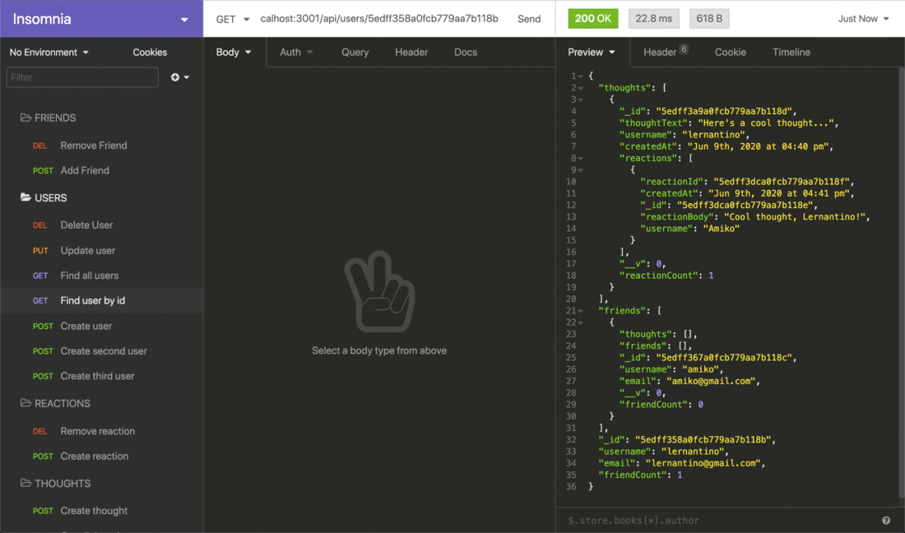

# Lets Get Social (NoSQL: Social Network API)

## PURPOSE

Can't have enough wys to connect with pepople, social networks find new ways to bridge the gap of distance between like minded people who want to converse. This application satisfies that need for social media users.This application is built with an API for a social network web application where users can share their thoughts, react to friends’ thoughts, and create a friend list. Express.js is used for routing, a MongoDB database, and the Mongoose ODM [Express.js](https://www.npmjs.com/package/express) and [Mongoose](https://www.npmjs.com/package/mongoose) packages. Data is created using Insomnia.

## User Story

```md
AS A social media startup
THE USER WANT an API for my social network that uses a NoSQL database
SO THAT my website can handle large amounts of unstructured data
```

## Acceptance Criteria

```md
GIVEN a social network API
WHEN the USER enter the command to invoke the application
THEN the server is started and the Mongoose models are synced to the MongoDB database
WHEN opening the API GET routes in Insomnia for users and thoughts
THEN the data for each of these routes is displayed in a formatted JSON
WHEN the USER test API POST, PUT, and DELETE routes in Insomnia
THEN the USER is able to successfully create, update, and delete users and thoughts in my database
WHEN the USER test API POST and DELETE routes in Insomnia
THEN the USER is able to successfully create and delete reactions to thoughts and add and remove friends to a user’s friend list
```
## Contributors 

```
Google, ChatGpt, and Morzilla.
```
### License


## Gif

The following animations show examples of the application's API routes being tested in Insomnia.

The following animation shows GET routes to return all users and all thoughts being tested in Insomnia:


The following animation shows GET routes to return a single user and a single thought being tested in Insomnia:



The following animation shows the POST, PUT, and DELETE routes for users being tested in Insomnia:


In addition to this, your walkthrough video should show the POST, PUT, and DELETE routes for thoughts being tested in Insomnia.

The following animation shows the POST and DELETE routes for a user’s friend list being tested in Insomnia:


In addition to this, your walkthrough video should show the POST and DELETE routes for reactions to thoughts being tested in Insomnia.

### Links

* A walkthrough video demonstrating the functionality of the application:

* The URL of the GitHub repository: https://github.com/NewManuel/18-Lets.Get.Social

